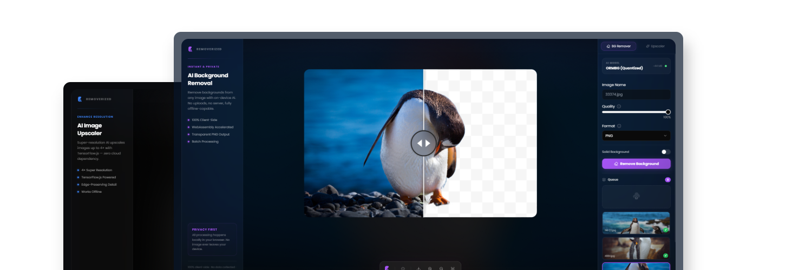

<h1 align="center">✨ Removerized - Free AI Background Remover Tool</h1>

<p align="center">
🖼️ Effortlessly Remove Image Backgrounds with AI - 🆓 Free & Limitless with 🛩️ Offline Support
</p>

<p align="center">
<a href="https://removerized.pages.dev/" target="_blank">removerized.pages.dev</a>
</p>



    🛑 Project Status: Open Source Version Discontinued
    This Open Source version of the project will no longer be maintained due to licensing restrictions imposed by (@imgly/background-removal), which is released under the AGPL license.

    Since we plan to transition this project into a SaaS product, we will be replacing this library with an alternative solution that allows for a more flexible licensing model.

    We appreciate the support from the community, and we will share updates on the new version as development progresses. Stay tuned! 🚀

<div align="center">


</div>

## ✨ Features

* 🌟 Effortlessly Remove Image Backgrounds with AI! 🤖
* 💡 Free & Limitless: No hidden costs or usage limits!
* 🔌 Offline Support: No internet connection needed!
* 🚀 Fast & Accurate: AI-powered technology for quick and precise background removal.
* 🛠️ Easy-to-Use: User-friendly interface for a seamless experience.
* 🌈 Versatile: Perfect for any image, any occasion!

## ⚖️ License


```monospace
Removerized is free software: you can redistribute it and/or modify
it under the terms of the GNU General Public License as published by
the Free Software Foundation, version 3 of the License

Removerized is distributed in the hope that it will be useful,
but WITHOUT ANY WARRANTY; without even the implied warranty of
MERCHANTABILITY or FITNESS FOR A PARTICULAR PURPOSE. See the
GNU General Public License for more details.

You should have received a copy of the GNU General Public License
along with Removerized. If not, see <https://www.gnu.org/licenses/>.
```

## Credits

This project uses `imgly/background-removal-js`, which is licensed under the GNU Affero General Public License v3.0.  
For more details, visit the official repository: <https://github.com/imgly/background-removal-js>
