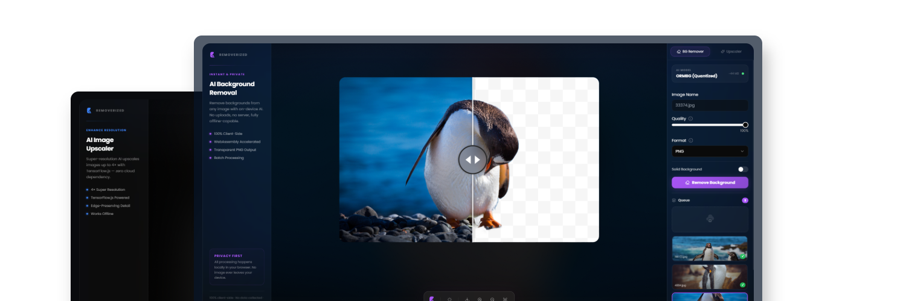

<h1 align="center">✨ Removerized</h1>

<p align="center">
🖼️ AI Image Toolkit that runs fully in your browser — free, private, and offline-first.
</p>

<p align="center">
<a href="https://getremoverized.yoss.pro/" target="_blank">Live Demo</a>
</p>



---

## 🚀 Overview

**Removerized** is an open-source, local-first AI image toolkit that runs entirely in the browser using ONNX Runtime Web.

No uploads. No servers. No limits.

All processing happens directly on your device.

---

## ✨ Features

* 🧠 **Multiple AI Models** — choose the model that best fits your needs
* 🖼️ **Background Removal** — fast, accurate, and fully local
* 🔍 **Image Upscaling** — enhance resolution with AI
* 📦 **Batch Processing** — process multiple images at once
* 💾 **Model Caching** — models are stored in IndexedDB for instant reuse
* 🔌 **Offline Ready** — works without internet after first load
* ⚡ **Client-Side Only** — zero backend, zero data collection
* 🎛️ **Advanced Controls** — tweak quality, format, and output

---

## 🧩 Tech Stack

<div align="center">


</div>

---

## 🧠 How It Works

* Models are loaded directly in the browser
* Inference runs using WebAssembly (WASM)
* Assets are cached locally via IndexedDB
* No data ever leaves your device

---

## 🎯 Philosophy

Removerized is built around a simple idea:

> AI tools should be fast, private, and accessible to everyone.

This project focuses on:

* 🛡️ Privacy-first processing
* ⚡ Performance through local execution
* 🧑‍💻 Developer-friendly experimentation

---

## 🛠️ Getting Started

```bash
pnpm install
pnpm dev
```

---

## 📌 Roadmap

* 🎨 Image colorization
* 🧓 Photo restoration
* 🏷️ Image → Alt text (captioning)
* 🧪 Advanced mask editing tools
* 📲 PWA support
* 🧩 Browser extension

---

## 🤝 Contributing

Contributions, ideas, and feedback are welcome!

Feel free to open issues or submit pull requests.

---

## ⚖️ License


```monospace
Removerized is free software: you can redistribute it and/or modify
it under the terms of the GNU General Public License as published by
the Free Software Foundation, version 3 of the License.

Removerized is distributed in the hope that it will be useful,
but WITHOUT ANY WARRANTY; without even the implied warranty of
MERCHANTABILITY or FITNESS FOR A PARTICULAR PURPOSE. See the
GNU General Public License for more details.

You should have received a copy of the GNU General Public License
along with Removerized. If not, see <https://www.gnu.org/licenses/>.
```

---

<p align="center">
Made with ❤️ by Yoss
</p>
